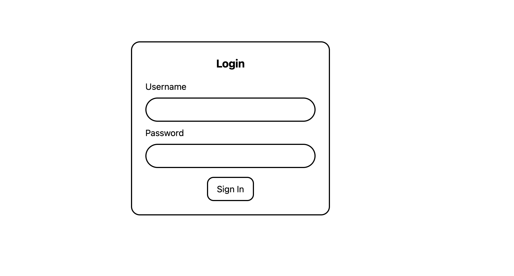
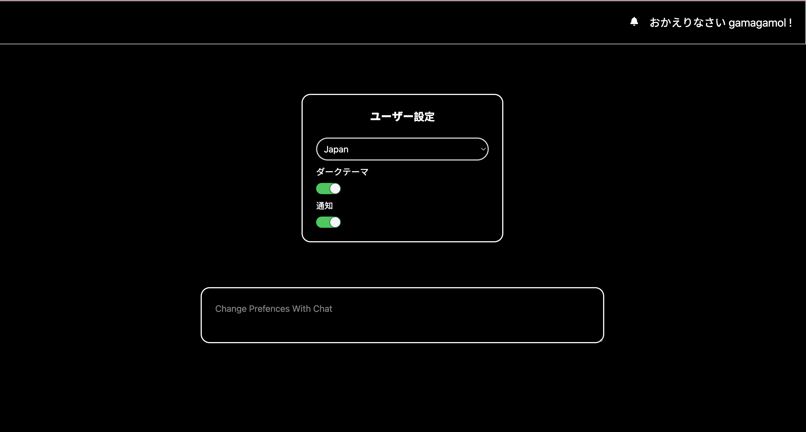

# 🧠 User Preferences App with Mock AI

A fullstack application to manage user preferences such as theme (dark/light), language, and notifications. Includes a *mock AI* feature that allows users to type natural language commands to update their preferences.

## 📦 Tech Stack

- **Frontend**: React + Vite + Tailwind CSS + Redux
- **Backend**: Flask (Python)
- **Database**: MongoDB
- **Deployment**: Docker + Docker Compose

---

## ✅ Prerequisites

Make sure you have installed:

- [Docker](https://www.docker.com/)
- [Docker Compose](https://docs.docker.com/compose/install/)

---

---

## 🚀 How to Run the Application

Follow these steps to run the entire stack using Docker:

### 1. Clone the repository

```bash
git clone https://github.com/gamagamol/UserPrefAI.git
cd UserPrefAI
docker compose up --d

```

### 2. open Browser In http://localhost:5173



default Username : gamagamol
default password : gamagamol


### 3. Change Preferences wihout prompt




Upon successful login, the preferences will be initialized with default values from the backend. You can modify these defaults, such as:
1.Toggling the dark mode
2.Enabling or disabling notifications
3.Changing the language
4.When dark mode is activated, the general color scheme will switch to darker tones. Conversely, when dark mode is turned off, the color scheme will return to a lighter, white background.
5.When notifications are disabled, the notification icon will be updated to reflect this change.
6.Additionally, when you change the language, the labels and text within the interface will update accordingly. This application currently supports three languages: Indonesian, Japanese, and English.

