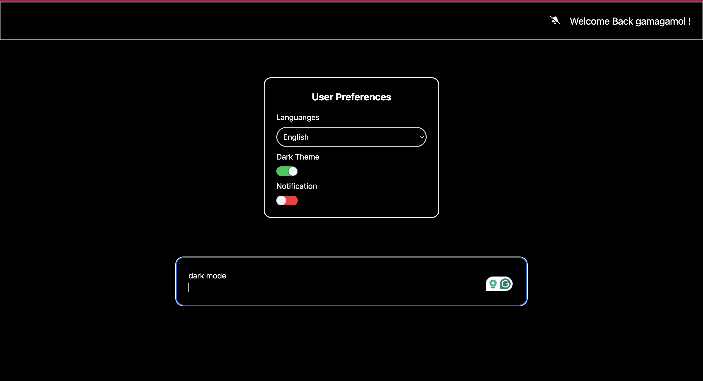

# 🧠 User Preferences App with Mock AI

A fullstack application to manage user preferences such as theme (dark/light), language, and notifications. Includes a *mock AI* feature that allows users to type natural language commands to update their preferences.

## 📦 Tech Stack

- **Frontend**: React + Vite + Tailwind CSS + Redux
- **Backend**: Flask (Python)
- **Database**: MongoDB
- **Deployment**: Docker + Docker Compose

---

## ✅ Prerequisites

Make sure you have installed:

- [Docker](https://www.docker.com/)
- [Docker Compose](https://docs.docker.com/compose/install/)

---

---

## 🚀 How to Run the Application

Follow these steps to run the entire stack using Docker:

### 1. Clone the repository

```bash
git clone https://github.com/gamagamol/UserPrefAI.git
cd UserPrefAI
docker compose up --d

```

### 2. open Browser In http://localhost:5173


default Username : gamagamol
default password : gamagamol


### 3. Change Preferences wihout prompt


User Preferences
Overview
The user preferences panel allows you to customize your experience within the application. After logging in successfully, your preferences will be initialized with default values from the backend.
Available Preferences
Dark Mode
Toggle between light and dark color schemes for the application.

When enabled: The interface adopts darker tones for a more comfortable viewing experience in low-light environments
When disabled: The interface uses a lighter color scheme with white backgrounds

Notifications
Control whether you receive system notifications.

When enabled: You will receive all relevant notifications
When disabled: The notification icon will update to reflect this change, and you won't receive any notifications

Language Selection
Choose your preferred language for the interface.
Currently supported languages:

English
Indonesian
Japanese

When you change the language, all labels, text, and interface elements will update immediately to reflect your selected language.
Usage
The preferences panel is designed to be intuitive. Simply toggle switches or select options from dropdown menus to customize your experience. All changes are saved automatically and will persist across sessions.


## 💬 Change Preferences Using Prompt

If you want to test changing preferences using the prompt, you can use the following commands:

### 🌙 Dark Mode
- `dark mode`
- `dark mode on`
- `nyalakan mode gelap` *(Indonesian)*
- `ダークモード` *(Japanese)*
- `ダークモードをオンにする` *(Japanese)*

### ☀️ Light Mode
- `light mode`
- `dark mode off`
- `mode terang` *(Indonesian)*
- `matikan mode gelap` *(Indonesian)*
- `ライトモード` *(Japanese)*
- `ダークモードをオフにする` *(Japanese)*

### 🔕 Notification
- `notification on`
- `notification off`
- `nyalakan pemberitahuan` *(Indonesian)*
- `matikan pemberitahuan` *(Indonesian)*
- `通知をオンにする` *(Japanese)*
- `通知をオフにする` *(Japanese)*

### 🌐 Change Language
- `change language to indonesia`
- `ubah bahasa menjadi bahasa indonesia` *(Indonesian)*
- `インドネシア語に変更` *(Japanese)*

- `change to english`
- `ubah bahasa menjadi bahasa inggris` *(Indonesian)*
- `英語に変更` *(Japanese)*

- `change to japan`
- `ubah bahasa menjadi bahasa jepang` *(Indonesian)*
- `日本語に変更` *(Japanese)*





